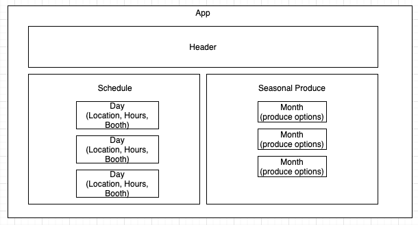

# _Avery's Organics_

_17 November 2020_

#### _React website for a fake farm_

#### By _**Vanessa Stewart**_

## Description

_This is an exercise for Epicodus to practice working with React components, states, and loops. This is a website for a fake farm that displays location information based on the day of the week and product information based on the season._

## Website Components Planning

## Setup/Installation Requirements

* Navigate to the directory in which you would like to clone this project.
* Run `git clone https://github.com/vanmars/avery-organics.git` in terminal.
* Run `cd avery organics` to navigate into new project directory.
* Open the cloned repo in a text editor of your choice.
* Run `npm install` to download all dependencies.
* Run `npm run start` to start a live server and view projec in the browser.
* Run `npm run test` to run tests.

## Known Bugs

Currently, the ProductList.js file is filler for SeasonalProduce.js, which would allow content to populate dynamically, but the file is not working yet.

## Support and Contact Details

_Connect with me at vamariestewart@gmail.com with ideas to improve this project._

## Technologies Used

* HTML
* CSS
* JavaScript/JSX
* NPM
* Webpack

## Photo Credits
Photo by <a href="https://unsplash.com/@zoltantasi?utm_source=unsplash&amp;utm_medium=referral&amp;utm_content=creditCopyText">Zoltan Tasi</a> on <a href="https://unsplash.com/s/photos/farmhouse?utm_source=unsplash&amp;utm_medium=referral&amp;utm_content=creditCopyText">Unsplash</a>
Photo by <a href="https://unsplash.com/@the_modern_life_mrs?utm_source=unsplash&amp;utm_medium=referral&amp;utm_content=creditCopyText">Heather Ford</a> on <a href="https://unsplash.com/s/photos/farmhouse?utm_source=unsplash&amp;utm_medium=referral&amp;utm_content=creditCopyText">Unsplash</a>

### License

Copyright (c) 2020 **_Vanessa Stewart_**

Permission is hereby granted, free of charge, to any person obtaining a copy of this software and associated documentation files (the "Software"), to deal in the Software without restriction, including without limitation the rights to use, copy, modify, merge, publish, distribute, sublicense, and/or sell copies of the Software, and to permit persons to whom the Software is furnished to do so, subject to the following conditions:

The above copyright notice and this permission notice shall be included in all copies or substantial portions of the Software.

THE SOFTWARE IS PROVIDED "AS IS", WITHOUT WARRANTY OF ANY KIND, EXPRESS OR IMPLIED, INCLUDING BUT NOT LIMITED TO THE WARRANTIES OF MERCHANTABILITY, FITNESS FOR A PARTICULAR PURPOSE AND NONINFRINGEMENT. IN NO EVENT SHALL THE AUTHORS OR COPYRIGHT HOLDERS BE LIABLE FOR ANY CLAIM, DAMAGES OR OTHER LIABILITY, WHETHER IN AN ACTION OF CONTRACT, TORT OR OTHERWISE, ARISING FROM, OUT OF OR IN CONNECTION WITH THE SOFTWARE OR THE USE OR OTHER DEALINGS IN THE SOFTWARE.